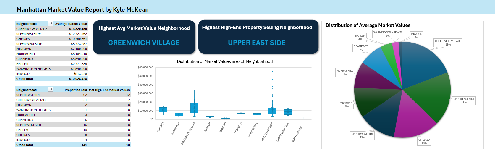

# Project Overview

Your dataset contains property sales for one-family dwellings in Manhattan over the last 12 months, including each property's zip code, building class, square feet, and sale price. However, records have have a sale price of $0 whenever there was a transfer of ownership without a cash consideration (like from parents to children).

## Objective

My task is create a new market value column that uses the recorded sale price when available, or estimates it by using the average price per square foot from properties within the same zip code and building class.

### Tools Used
- Microsoft Excel
- Excel Tables
- Functions Used:
  - AVERAGEIFS
  - IF
  - Pivot Tables
  - Pivot Charts / dashboard elements

### Dataset Fields Used

The analysis relied on the following columns:

- Neighborhood
- Address
- Zip Code
- Building Class
- Square Feet
- Sale Price

## Step-by-Step Process
### 1. Import and review the dataset
    - Open the dataset in Excel
    - Review the available columns and identify the key variables needed for valuation
    - Confirm that some records have a Sale Price of 0

### 2. Convert the raw data into an Excel Table

This makes formulas easier to manage and keeps the analysis scalable.

### 3. Create a Price per Square Foot column
    - Add a new column to calculate the recorded price per square foot for valid sales.

This calculates price per square foot only when a true sale price exists.

### 4. Estimate the average price per square foot for comparable properties

Create a formula that calculates the average price per square foot for rows with the same:

Zip Code
Building Class
Sale Price greater than 0

This creates a comparable pricing benchmark for each property.

### 5. Create the Market Value column

Build a new column that:

Uses the actual sale price if it exists
Otherwise estimates value using:
average price per square foot × property square feet

### 6. Format the calculated values
Format Sale Price and Market Value as currency
Check for rows that may still return errors or blanks
Validate that square footage values are present where estimates are needed

### 7. Create a Pivot Table for summary analysis
To further analyze the dataset provided I decided to create a dashboard to possibly look for insights into this housing market.
Created a new "high-value" housing market column in the originial table to classify any building worth more than $15 million as a high-value price. 

From this I was able to create a pivot table for the average market value and another for properties sold in each neighborhood to possibly see if there are any insights to be found in any particular area.

From this short analysis we can see an interesting insight in the Upper East Side neighborhood.

1. There is a clear set of outliers in high-end properties sold in the Upper East Side neighborhood even though there average market value is less than Greenwich Village

This could signal changes in the wealth distribution for this area that could be due to environmental causes. If one were to look into recent changes in the local culture, businesses, or general economic factors this could indicate a trend of high-class property owners seeking to leave the manhattan area. 

### Final Analysis

Although there are a multitude of factors that may be the source of this trend, if more research were to be done it may highlight growing changes in the economic distribution of these neighborhoods.

